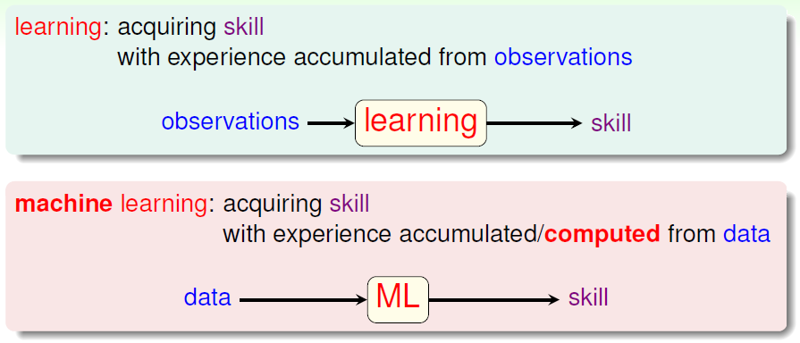
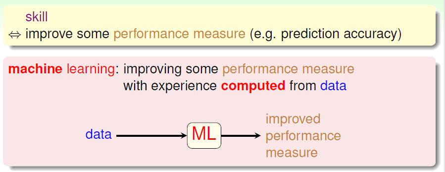
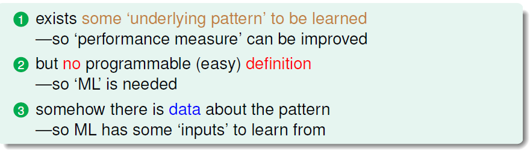
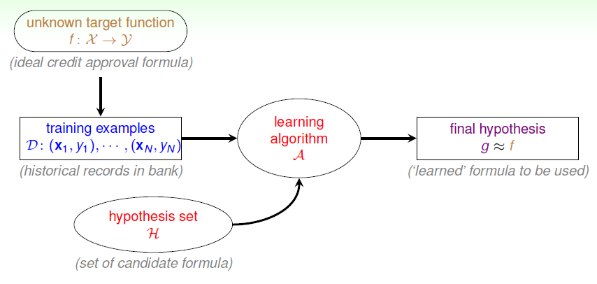

# The Learning Problem

### 什么是机器学习

学习就是人类通过观察积累经验，掌握技能。

机器学习就是让机器像人类一样，通过数据计算或积累的经验，掌握技能。

所谓技能，就是提升某种性能指标，如预测准确率。

更具体的定义：机器学习就是利用从数据中计算获得的经验来改进一些性能指标。

### 何时可用机器学习

机器学习的关键要素：

- 存在一些要学习的“潜在模式”。
- 但是没有可编程的简单定义。
- 有模式相关的数据可供学习。

### 机器学习构成

基本符号：

- 输入 $\boldsymbol{x} \in \mathcal{X}$ 
- 输出 $y \in \mathcal{Y}$
- 未知的目标函数 $f: \mathcal{X} \rightarrow \mathcal{Y}$
- 训练集 $D=\{ (\boldsymbol{x_1},y_1),(\boldsymbol{x_2},y_2),...,(\boldsymbol{x_N},y_N) \}$
- 假设集 $\mathcal{H}$，所有假设的集合
- 表现良好性能的机器学习产生的函数 $g:\mathcal{X} \rightarrow \mathcal{Y}$
- 演算法 $\mathcal{A}$，从假设集中选出适合的假设作为生成函数 $g$
- 模型就是演算法和假设集。

机器学习的构成，简言之就是 $\mathcal{A}$ takes $\mathcal{D}$ and $\mathcal{H}$ to get $g$。

机器学习的流程图可表示为：

