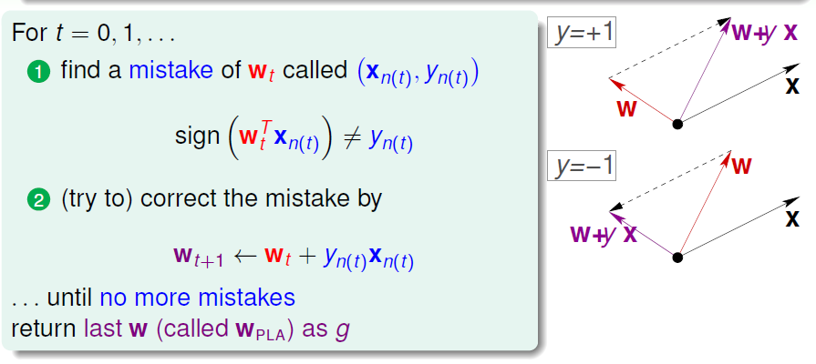
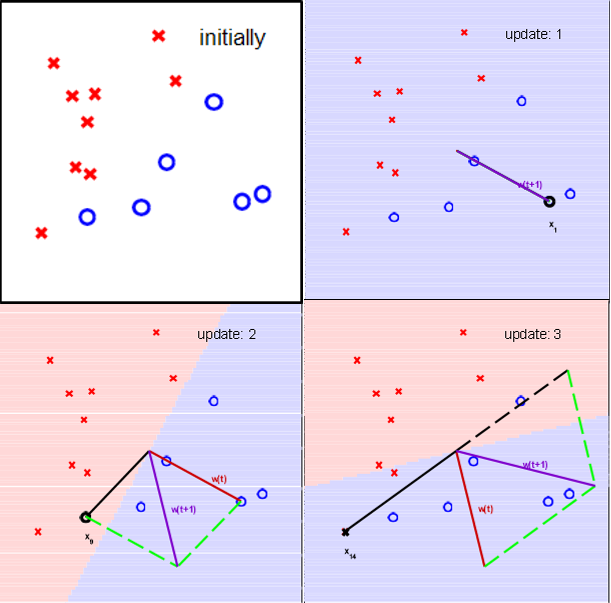
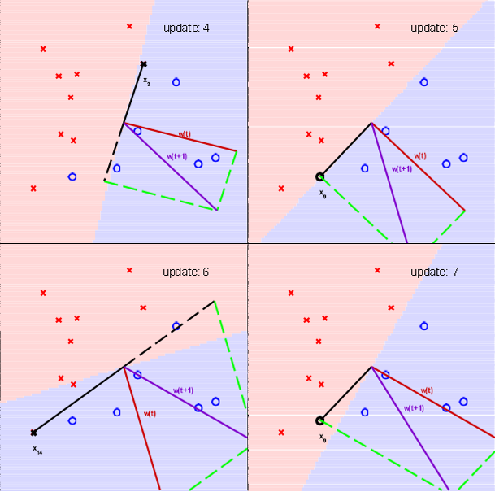
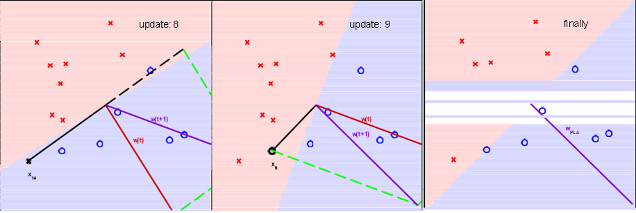
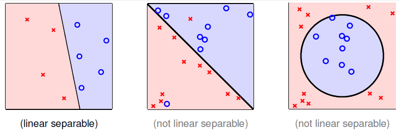
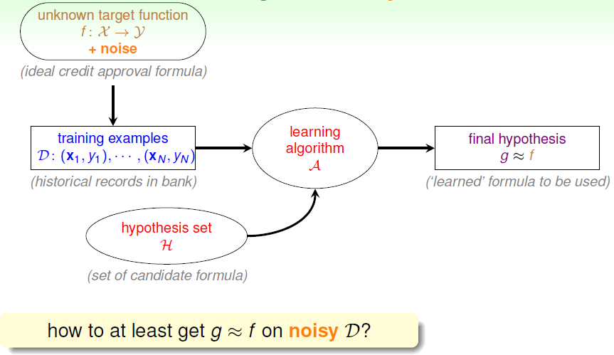
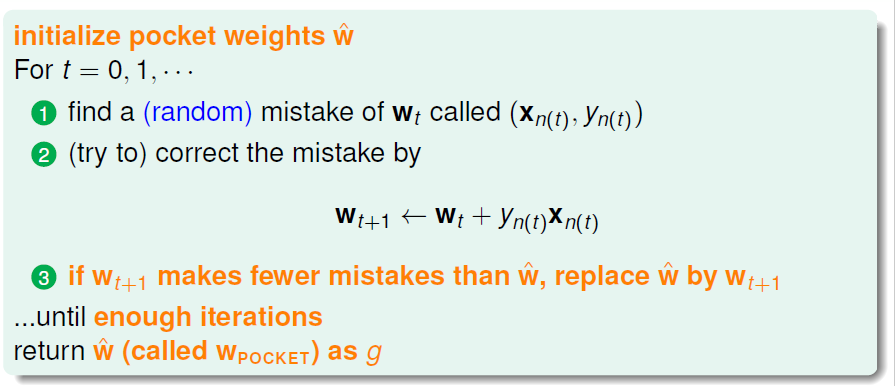

# Learning to Answer Yes/No

引入实例：银行根据用户信息判断是否该向用户发访信用卡，已知数据建立决策模型。

### 一个简单的假设集：感知器 Perceptron

对于用户特征 $\mathbf{x} = (x_1,x_2,...x_d)$，计算特征权值以判断接收或拒绝用户请求：

- 如果 $\sum_{i=1}^dw_ix_i > threshold$，则接收请求；
- 如果 $\sum_{i=1}^{d}w_ix_i < threshold$，则拒绝请求。

简化输出集 $\mathcal{Y}:\{+1(good),-1(bad)\}$。

感知器模型，就是当特征加权和大于阈值，则输出 $h(x)=1$，特征加权和小于阈值，则输出 $h(x)=-1$，即 $h(x) = sign((\sum_{i=1}^dw_ix_i)-threshold)$。我们的目的就是计算权值 $w$ 和阈值 $threshold$。

为计算方便，通常将阈值 $threshold$ 当作 $w_0$，引入 $x_0=1$ 与 $w_0$ 相乘，$h(x)$ 的表达式做如下变换：
$$
\begin{align}
h(x) 	&= sign((\sum_{i=1}^dw_ix_i)-threshold) \\
		&= sign((\sum_{i=1}^dw_ix_i)+\underbrace{(-threshold)}_{w_0}\cdot \underbrace{(+1)}_{x_0}) \\
		&= sign(\sum_{i=0}^dw_ix_i)\\
		&= sign(\mathbf{w^Tx})
\end{align}
$$

**二维平面 $\mathbb{R^2}$上的感知器模型：**
$$
h(\mathbf{x})=sign(w_0+w_1x_1+w_2x_2)
$$

- 特征向量 $\mathbf{x}$，即平面上的点（$\mathbb{R^d}$ 空间上的点）。
- 标签 $y$，$\mathcal{Y}=\{+1,-1\}$。
- 假设 $h$，平面上的直线（$\mathbb{R^d}$ 空间的超平面），正的都在一侧，负的都在另一侧。

可见，感知器模型是线性（二元）的分类器。

### 感知器学习算法 Perceptron Learning Algorithm,PLA

我们已知假设集 $\mathcal{H}$ 由许多直线构成，则需要设计演算法 $\mathcal{A}$，从假设集 $\mathcal{H}$ 中选出最好的直线，能够将平面上的所有正和负的点分开，即找到最好的 $g$。理想情况下在数据集 $\mathcal{D}$ 中满足 $g \approx f$，$g(\mathbb{x_n}=f(\mathbb{x_n}) = y_n$。

但当假设集 $H$ 包含无限多个假设是，很难找到最优解。因此使用逐点修正的思想，PLA 算法如下：

选取一初始直线 $\mathbf{w_0}$，找到以此直线划分的一个错误点 $(\mathbf{x_{n(t)}},y_{n(t)})$，即 $sign(\mathbf{w^T_tx_{n(t)}}) \neq y_{n(t)}$。以错误点对直线进行修正，直至所有点都不产生错误。返回最后的 $\mathbf{w_{PLA}}$ 作为 $g$。

具体的修正方法如图：找到一个分类错误的点，如果这个点表示正而被错分为负，即 $\mathbf{w^Tx}<0$ 表示 $\mathbf{w}$ 和 $\mathbf{x}$ 夹角大于 90 度， 其中 $\mathbf{w}$ 是直线的法向量。$\mathbf{x}$ 被误分在直线的下侧（相对于法向量，法向量的方向即为正所在的一侧），修正的方法是使 $\mathbf{w}$ 和 $\mathbf{x}$ 夹角小于 90 度。通常的做法是 $\mathbf{w} \leftarrow \mathbf{w} + y\mathbf{x}, y=1$。更新后的 $\mathbf{w}$ 与 $\mathbf{x}$ 夹角小于 90 度，保证 $\mathbf{x}$ 位于直线上侧，对误分为负的错误点完成了修正。同样，如果该点表示负而被错分为正，修正 $\mathbf{w} \leftarrow \mathbf{w} + y\mathbf{x},y=-1$。

按照此种修正方法，每次修正直线，可能使之前分类正确的点变成错误点，不断迭代修正，最终会将所有点正确分类（前提是数据集线性可分）。算法的思想就是“知错能改“，`A fault confessed is half redressed.`

修正过程如下：

PLA 的一些问题：

- PLA 会停下来吗？
  - 停下来则表示在 $\mathcal{D}$ 中保证了 $g\approx f$，那在数据集以外呢？
  - 如果停不下来呢？

### PLA 推导

#### 线性可分性

如果 PLA 停下来，也就是数据集 $\mathcal{D}$ 中没有分类错误的点，则 $\mathcal{D}$ 中存在可正确分类的直线 $\mathbf{w}$，则称这样的数据集 $\mathcal{D}$ 线性可分。

对于线性可分的数据集 $\mathcal{D}\ \Longleftrightarrow$ 存在完美的 $\mathbf{w_f}$ 对任一点满足 $y_n = sign(\mathbf{w_f^Tx_n})$，即对任一点有：
$$
y_{n(t)}\mathbf{w_f^Tx_{n(t)}} \geq \min\limits_{n}{y_n\mathbf{w_f^Tx_n}} > 0 \tag{1}
$$
计算 $\mathbf{w_f^T}$ 与 $\mathbf{w_{t+1}}$ 的内积：
$$
\begin{align}
\mathbf{w_f^Tw_{t+1}}	&= \mathbf{w_f^T}(\mathbf{w_t} + y_{n(t)}\mathbf{x_{n(t)}}) \tag{2}\\
						&\geq \mathbf{w_f^T}\mathbf{w_t} + \min\limits_n{y_n\mathbf{w_f^T}\mathbf{x_n}} \\
						&> \mathbf{w_f^Tw_t} + 0
\end{align}
$$
可见，$\mathbf{w_f}$ 与 $\mathbf{w_t}$ 的内积变大，表明向量间角度变小即二者更接近，或向量长度变大。接下来就证明 $\mathbf{w_{t+1}}$ 与 $\mathbf{w_t}$ 向量长度的关系，首先修正仅发生在错误点，即$sign(\mathbf{w_f^Tx_{n(t)}}) \neq y_{n(t)} \Leftrightarrow y_{n(t)}\mathbf{w_f^Tx_{n(t)}} \leq 0$，这决定了向量长度 $\|\mathbf{w_t}\|$ 的增长被限制：
$$
\begin{align}
\|\mathbf{w_{t+1}}\|^2	&= \|\mathbf{w_t}+y_{n(t)}\mathbf{x_{n(t)}}\|^2 \tag{3}\\
						&= \|\mathbf{w_t}\|^2 + 2y_{n(t)}\mathbf{w_t^Tx_{n(t)}} + \|y_{n(t)}\mathbf{x_{n(t)}}\|^2 \\
						&\leq \|\mathbf{w_t}\|^2 + 0 + \|y_{n(t)}\mathbf{x_{n(t)}}\|^2 \\
						&\leq \|\mathbf{w_t}\|^2 + \max\limits_{n}{\|y_n\mathbf{x_n}\|^2} \\			
\end{align}
$$
则初始权值 $\mathbf{w_0} = 0$，则经过 T 次错误修正后，有 $\frac{w_f^T}{\|w_f\|}\cdot\frac{w_t}{\|w_t\|} \geq \sqrt{T}\cdot constant$：
$$
\begin{align}
\mathbf{w_f^Tw_t}	&= \mathbf{w_f^T}(\mathbf{w_{t-1}} + y_{n(t-1)}\mathbf{x_{n(t-1)}}) \tag{4}\\
					&\geq \mathbf{w_f^Tw_{t-1}} + \min\limits_{n}{y_n\mathbf{w_f^Tx_n}}\qquad using\ (1)\\
					&\geq \mathbf{w_0} + T\cdot \min\limits_{n}{y_n\mathbf{w_f^Tx_n}}\qquad \quad applying\ T\ times \\
					&\geq T\cdot \min\limits_{n}{y_n\mathbf{w_f^Tx_n}}
\end{align}
$$

$$
\begin{align}
\|\mathbf{w_t}\|^2	&= \|\mathbf{w_{t-1}} + y_{n(t-1)}\mathbf{x_{n(t-1)}}\|^2 \tag{5}\\
					&= \|\mathbf{w_{t-1}}\|^2 + 2y_{n(t-1)}\mathbf{w_t^Tx_{n(t-1)}} + \|y_{n(t-1)}\mathbf{x_{n(t-1)}}\|^2 \\
					&\leq \|\mathbf{w_{t-1}}\|^2 + 0 + \|y_{n(t-1)}\mathbf{x_{n(t-1)}}\|^2 \\
					&\leq \|\mathbf{w_{t-1}}\|^2 + \max\limits_{n}\|y_n\mathbf{x_n}\|^2 \\
					&\leq \|\mathbf{w_0}\|^2 + T\cdot \|\mathbf{x_n}\|^2 = T\cdot \max\limits_{n}\|\mathbf{x_n}\|^2
\end{align}
$$

由 $(4),(5)$ 两式，得到：
$$
\begin{align}
\frac{w_f^T}{\|w_f\|}\cdot\frac{w_t}{\|w_t\|}	&\geq	\frac{T\cdot \min\limits_{n}y_n\mathbf{w_f^T}\mathbf{x_n}}{\|\mathbf{w_f^T}\|\cdot \|\mathbf{w_t}\|} \tag{6} \\
&\geq \frac{T\cdot \min\limits_{n}y_n\mathbf{w_f^T}\mathbf{x_n}}{\|\mathbf{w_f^T}\|\cdot \sqrt{T}\cdot \max\limits_{n}{\|\mathbf{x_n}\|}} \\
&\geq \frac{\sqrt{T}\cdot \min\limits_{n}y_n\mathbf{w_f^T}\mathbf{x_n}}{\|\mathbf{w_f^T}\|\cdot \max\limits_{n}{\|\mathbf{x_n}\|}} = \sqrt{T}\cdot constant
\end{align}
$$

且 $\frac{w_f^T}{\|w_f\|}\cdot\frac{w_t}{\|w_t\|}$ 的值为两个向量夹角的余弦值，$\frac{w_f^T}{\|w_f\|}\cdot\frac{w_t}{\|w_t\|} \leq 1$ ：
$$
R = \max\limits_{n}{\|\mathbf{x_n}\|^2}, \rho = \min\limits_{n}{y_n\frac{\mathbf{w_f^T}}{\|\mathbf{w_f}\|}}\mathbf{x_n} \\
\frac{\sqrt{T}\cdot \min\limits_{n}y_n\mathbf{w_f^T}\mathbf{x_n}}{\|\mathbf{w_f^T}\|\cdot \max\limits_{n}{\|\mathbf{x_n}\|}} \leq 1 \\
\Longleftrightarrow T \leq \frac{\max\limits_{n}{\|\mathbf{x_n}\|^2}}{{(\min\limits_{n} y_n\frac{\mathbf{w_f^T}}{\|\mathbf{w_f}\|}\mathbf{x_n}})^2} \\
\Longleftrightarrow T \leq \frac{R^2}{\rho^2}
$$
由此，证明了对于线性可分的数据集，PLA 的迭代次数 $T$ 是有上界的，$\mathbf{w_t}$ 与 $\mathbf{w_f}$ 的内积随迭代次数增加得比向量长度快，即向量夹角变小，$\mathbf{w_t}$ 与 $\mathbf{w_f}$ 逐渐接近，最终 PLA 会停下来，完成对线性可分的数据集的分类。

### 非线性可分的数据

对于线性可分的数据集，PLA 对多维度空间是易于实现且有效的。但因为 $\mathbf{w_f}$ 未知，就无法计算迭代次数 $T$ 的上限，也就无法确定 PLA 何时能够停下来。

对于非线性可分的情况，可以将其当称数据集 $\mathcal{D}$ 中掺杂了 noise，此时的机器学习流程如下：

在非线性可分情况下，我们把条件方式，即容忍有错误点，取错误点最少时的权值 $\mathcal{w}$。在数据集上满足 $g\approx f$，即对大多数点 $y_n=g(\mathbf{x_n})$：
$$
\mathbf{w_g} \longleftarrow \mathop{argmin}\limits_{\mathbf{w}}\sum_{n=1}^N|[y_n \neq sign(\mathbf{w^Tx_n})]|
$$
这已经被证明是一个 NP-hard 问题，我们可以修改在线性可分中表现很好的 PLA，以适应非线性可分数据集，获得近似最好的 $g$。

#### Pocket Algorithm

修改后的 PLA 成为 pocket Algorithm，它的流程与 PLA 基本类似，其思想就是把最优的权值放在口袋里。首先初始化权值 $\mathbf{w_0}$，计算出这条直线中分类错误点的个数，然后对错误点进行修正，更新 $\mathbf{w}$，得到新的直线，在计算其对应的分类错误点的个数，并于之前错误点个数比较，取个数较小的直线作为当前选择的分类直线。之后再经过 $n$ 次迭代，不断比较选择分类错误点个数较小的直线保存。直至迭代次数完成后，选取个数最少的直线对应的 $\mathbf{w}$，即得到我们想要的权值。

对于无法判断线性可分性的数据集 $\mathcal{D}$，使用 Pocket Algorithm，如果 $\mathcal{D}$ 线性可分，则 PA 要比 PLA 慢一些。