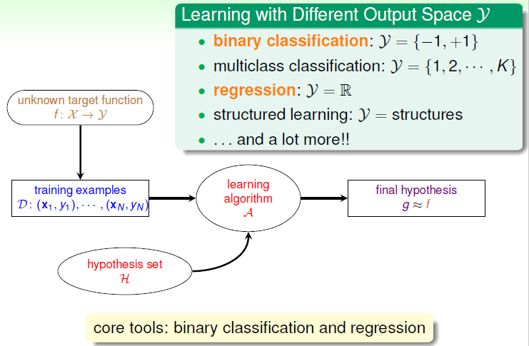
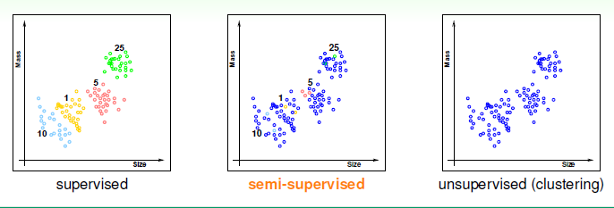
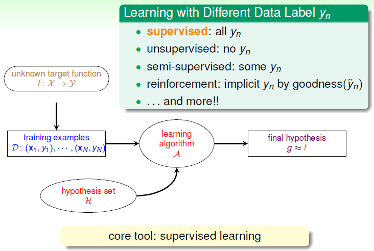
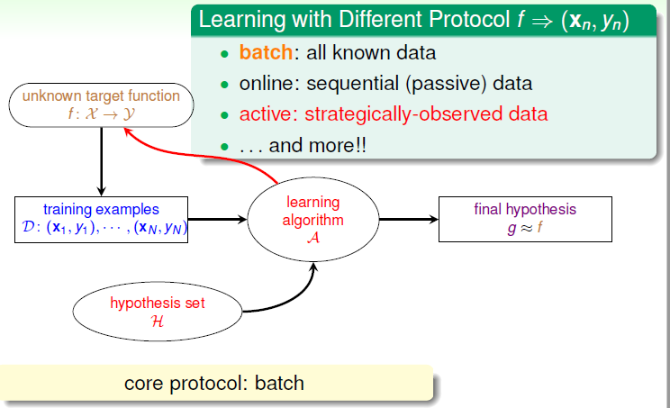
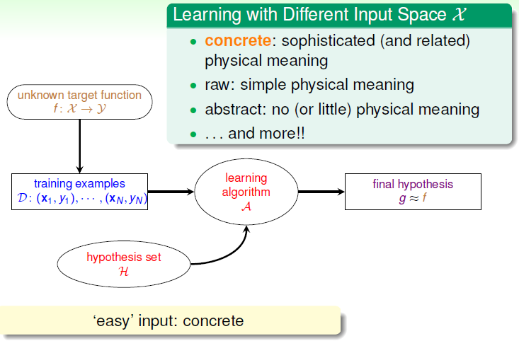

# Types of Learning

从之前的学习中我们已经大概了解了机器学习的流程，本节课将介绍机器学习的分类。

### 以输出空间划分

回顾之前的银行根据用户信息判断是否发放信用卡的问题，这是一个典型的二元分类的问题（Binary Classification），其输出有两个，即 $\mathcal{Y}=\{+1,-1\}$ 。二元分类的问题很常见，且是机器学习领域中核心和基本的问题，根据问题情况不同（如数据是否线性）选择不同的模型。

此外还有多元分类（Multiclass Classification）问题，即输出 $\mathcal{Y} =\{1,2,...,K\}$ 。一般多元分类的应用有内容分类识别等。分类问题输出都是离散值，而对于另一种情况，回归分析，输出 $\mathcal{Y} = \mathbb{R}$ 是连续的。最简单的回归分析就是线性回归。

自然语言处理中，还会涉及到一种机器学习问题：结构化学习（Structured Learning）。词性分类，用多元分类处理就是 word $\Rightarrow$ word class，而结构化学习是 sentence $\Rightarrow$ structure (class of each word)}。大规模的多元分类问题，类别之间有一定的结构关系。

简单总结，以输出空间划分的机器学习问题，包括二元分类、多元分类、回归分析、结构化学习等类型。其中二元分类和回归分析是最基础、最核心的问题，也是这门课的主要部分。

### 以数据标签划分

数据集 $\mathcal{D}$ 中既有输入特征 $\mathbf{x_n}$，还有输出 $y_n$ 的机器学习称为监督学习（Supervised Learning）。相对应的，数据集中没有输出标签 $y_n$ 的机器学习即为无监督学习。典型的无监督学习包括：聚类（Clustering）问题，即 $\{\mathbf{x_n}\} \Rightarrow cluster(\mathbf{x})$，类似于无监督的多元分类问题；密度分析，即 $\{\mathbf{x_n}\} \Rightarrow density(\mathbf{x})$，对应无监督的回归分析；异常检测，即 $\{\mathbf{x_n}\} \Rightarrow unusual(\mathbf{x})$，对应无监督的二元分类问题等等。

介于监督和无监督学习之间称为半监督学习（Semi-supervised Learning），即一部分数据有输出标签 $y_n$，另一部分没有。现实中如药物检测，受成本限制，无法对所有数据实验获得标签，只能以大量的未标签数据处理提高准确性。	

此外还有增强学习，对于输入的 $\mathbf{x}$，根据模型的输出反馈，如果反馈结果接近期望的输出，则给予正向激励，否则给予反向激励。核心在于以”反馈-修正“的模式优化模型。

简单总结，机器学习按照数据输出标签 $y_n$ 划分，包括监督学习、无监督学习、半监督学习和增强学习。

### 以协议 $f \Rightarrow (\mathbf{x_n},y_n)$ 划分

协议（Protocol）即学习的方式。

批量学习（Batch Learning），即分批拿到数据集 $\mathcal{D}$，对其进行学习建模，得到机器学习模型，又称填鸭式模型。在线学习（Online Learning），数据一个个输入，同步更新算法的动态过程。之前学过的 PLA 和 增强学习都可以使用在线学习。

主动学习（Active Learning），即让机器具备主动问问题的能力。在获取样本标签比较困难时，可以节约时间和成本，只对一些重要的标签提出需求。

### 以输入空间分类

前面的分类大部分都跟输出有关，现在来看输入 $\mathcal{X}$ 的类型。

具体特征（Concrete Features），$\mathcal{X} \subseteq \mathbb{R}^d$ 的每一维度都表示复杂的物理含义。具体的特征对机器学习来说最容易理解和使用。

原始特征（Raw Feature），如手写数字识别中每个数字图片的 $m\times n$ 像素值、声音频谱等。这种特征一般比较抽象，需要人或机器转换为对于的具体特征。

抽象特征（Abstract Feature），如评分预测，输出评分 $\mathcal{Y} \subseteq \mathbb{R}$，输入用户和作品的标识 $\mathcal{X} \subseteq \mathbb{N\times N}$，需要进行特征提取、构造或转换。

具体特征的机器学习相对简单且基础，是本课的着重点。对原始或抽象特征的处理将在《机器学习技法》中学习。

