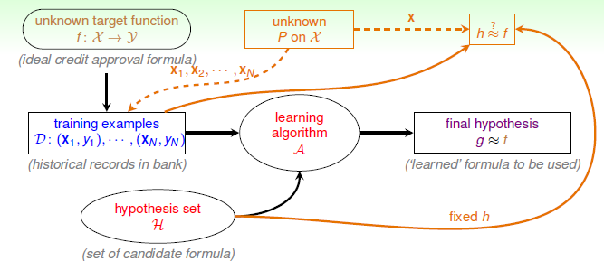

# Feasibility of Learning

本节将讨论机器学习的可行性。

### 机器学习是不可能的？

首先我们以人类学习的角度来看一个示例：如图，有三个标签为 $-1$  的九宫格和三个标签为 $+1$ 的九宫格。根据这六个样本，预测右侧的九宫格标签是 $+1$ 还是 $-1$ 。显然，结果并不确定，如果从比较简单的对称性的角度，不对称的为 $-1$，对称的为$+1$，那么就会有 $g(x)=+1$。而如果以九宫格左上角是否为黑色区分，则会得出 $g(x)=-1$。此外，还可以根据其他不同特征进行分类，得到不同的结果。对于每一个分类结果，我们都可以说它对或不对。

再看一个更数学化的例子，输入特征向量 $\mathcal{X}=\{0,1\}^3$，输出 $\mathcal{Y}=\{\circ,\times\}$，即共有 8 种输入，2 种输出，则对应的假设集为 $2^8$ 个 $g(\mathbf{x_n})$。给定训练集 $\mathcal{D}$ 中有 5 个样本，从假设集中找出满足 $g(\mathbf{x_n})=y_n$ 的所有可能，即我们确定在训练集 $\mathcal{D}$ 中满足 $g\approx f$。但是在训练集以外，$g\approx f$ 不一定成立。

这个例子告诉我们，想要通过对训练集 $\mathcal{D}$ 学习以达到对 $\mathcal{D}$ 以外的数据的正确分类似乎是不可能的。这种特性称为 No Free Lunch 定理，它说明了无法保证一个机器学习算法在 $\mathcal{D}$ 以外的数据集上一定能分类或预测正确，除非加上一些假设条件。所谓的算法的效果更好，只是针对特定的问题，特定的先验信息、数据分布、训练样本的数目等。

### 还能再抢救一下

上面得出的结论是：对训练集 $\mathcal{D}$ 以外的数据，机器学习很难做出正确分类或预测。那是否可以使用一些工具或方法对未知的目标函数做出一些推论，使得机器学习模型更有效。

如果有一个装有不可计数的橙色和绿色球的罐子，我们能否知道橙色球的比例 $\mu$ ？统计学的方法就是从中随机取出 $N$ 个球，计算其中橙色球的比例 $v$，就估计出罐子中橙色球的比例为 $\mu \approx v$。 显然这无法说明罐子里橙色球的比例一定是 $v$，但是 $v$ 在数学上有很大可能接近未知的 $\mu$。

已知 $\mu$ 是罐子中橙色球的比例，$v$ 是 $N$ 个抽取的样本中橙色球的比例。当样本容量 $N$ 足够大时，$v$ 接近 $u$。这就是 Hoeffding’s Inequality：
$$
\mathbb{P}[v - \mu|>\epsilon] \leq 2 \exp(-2\epsilon^2N)
$$
不等式说明，当 $N$ 很大时，$v$ 与 $\mu$ 差值超过 $\epsilon$ 的概率很小。结论 $v=\mu$ 是概率近似正确的（Probably Approximately Correct, PAC）。由此，我们就从已知的 $v$ 推导出了未知的 $\mu$。

### 对应到机器学习

将上面将的内容对应到机器学习的概念。

- 未知的罐子中橙色球的比例 $\mu$ $\Longleftrightarrow$ 假设集与目标函数是否相符 $h(\mathbf{x}) \mathop{=}\limits^? f(\mathbf{x})$
- 罐子中的球类比于输入空间 $\mathbf{x} \in \mathcal{X}$
- 橙色球对应 $h(\mathbf{x}) \neq f(\mathbf{x})$
- 绿色球对应 $h(\mathbf{x}) = f(\mathbf{x})$
- 大小为 $N$ 的样本空间对应训练集 $\mathcal{D} =\{ (\mathbf{x_n},\underbrace{y_n}_{f(\mathbf{x_n})})\}$，且 $\mathbf{x_n}$ 独立同分布的。

如果 $N$ 足够大且独立同分布，则可以从抽样样本的 $h(\mathbf{x_n})\neq f(\mathbf{x_n})$ 的概率推导出总体样本 $h(\mathbf{x})\neq f(\mathbf{x})$ 的概率。

映射中最关键的点是将抽样中的橙色球的比例理解为训练集 $D$ 上错误的概率，以此推算出在所有数据上错误的概率。因为这两种概率是 PAC 的，我们只要保证前者小，后者也就小了。

未知的分布 $P$ ，以此采样，从而得到训练集 $\mathcal{D}$； 同时以此衡量 $h\mathop{\approx}\limits^? f$。

引入两个值 $E_{in}(h)$ 与 $E_{out}(h)$，分别表示在抽样样本和总体中的错误概率：
$$
E_{out}(h)=\underset{\mathbf{x} \sim P}{\mathcal{E}}|[h(\mathbf{x}) \neq f(\mathbf{x})]| \\
E_{in}(h)=\frac{1}{N}\sum^N_1|[h(\mathbf{x_n})\neq y_n]|
$$
对应的 Hoeffding’s Inequality：
$$
\mathbb{P}[|E_{in}(h)-E_{out}(h)| > \epsilon] \leq 2\exp(-2\epsilon^2N)
$$
不等式表明，$E_{in}(h) = E_{out}(h)$ 也是 PAC 的，当 $E_{in}(h)$ 很小时，对应的 $E_{out}(h)$ 就很小，$h$ 与 $f$ 很接近，机器学习模型比较准确。

但是对应一个固定的 $h$，$N$ 足够大时有 $E_{in}(h)\approx E_{out}(h)$，但是并不意味着 $g\approx f$。因为并不能保证 $E_{in}(h)$ 足够小，所以真正的学习过程中需要演算法 $\mathcal{A}$ 从假设集 $\mathcal{H}$ 中选择使 $E_{in}(h)$ 足够小的 $h$。 对于固定的 $h$，需要使用新的数据验证其错误率：

### 真正的机器学习

从上面的讨论我们可以知道，对于某个特定的假设，其在全局的表现可以和其在数据集的表现 PAC，保证其数据集表现好，就能推断其能泛化。但是实际上我们往往有很多假设，我们从中挑选一个表现最好的（即 $E_{in}(h)$ 最小）的假设作为最终的 $g$ ，它在全局的表现一定是最好的吗？肯定不是。

有 $M$ 个罐子，对应 $M$ 个假设，如果某个罐子的抽样为全绿色，那是不是要选择这个罐子呢？

先看这样一个例子：150 个人抛硬币，那么至少有一个人连续 5 次硬币正面朝上的概率是：
$$
1 - (\frac{31}{32})^{150} > 99\%
$$
可见这个几率是很大的，但是这并不能说明 5 次正面朝上的这个硬币单次证明朝上的概率就很大，其实都是 0.5。一样的道理，抽样为全绿色球的时候也不能说明这个罐子就全是绿色球。当罐子数目很多或抛硬币的人数很多时，可能会引发 Bad Sample，即 $E_{in}(h)$ 与 $E_{out}(h)$ 相差很大，即选择过多带来了负面影响。

多次抽样得到不同的数据集 $\mathcal{D}$，Hoeffding’s Inequality 保证了大多数的 $\mathcal{D}$ 是比较好的，即对于某个 $h$，保证 $E_{in}(h)\approx E_{out}(h)$。但随着抽样次数增多，对应的会有 Bad Data，即 $E_{in}(h)$ 与 $E_{out}(h)$ 相差很大，如样本中错误率很低，但在全局中错误率很高。

如果数据集 $\mathcal{D_n}$ 对某个 $h_n$ 表现为 Bad Data，那么它就是 Bad Data。只有当 $\mathcal{D_n}$ 在所有的假设中都是好的数据，才说明它不是 Bad Data，演算法才可以自由选择假设 $h_n$ 作为 $g$。

那么对于 $M$ 个假设，我们关心的是 Bad Data 的概率：

其中 $M$ 表示假设个数，$N$ 是样本 $D$ 容量，$\epsilon$ 为参数。可得出，当 $M$ 有限，且 $N$ 足够大时，Bad Data 出现的概率就更低，即能保证 $D$ 对于所有的 $h$ 都有 $E_{in} = E_{out}$ 是 PAC 的，演算法 $\mathcal{A}$ 的选择不受限制。我们就可以像之前一样，选取一个合理的演算法（如 PLA/pocket），选择使 $E_{in}(h_m)$ 最小的 $h_m$ 作为 $g$ ，使得 $g\approx f$，即有不错的泛化能力。

即添加了一个分布 P 用以选择训练集 $D$ 并衡量假设是否满足 $g\approx f$。

正如上图右下角，回忆 PLA，我们发现，PLA 的假设集为无数条直线，那么是否就说以上的推论就不成立了呢？机器学习就此失效？这将在之后的课程中介绍。