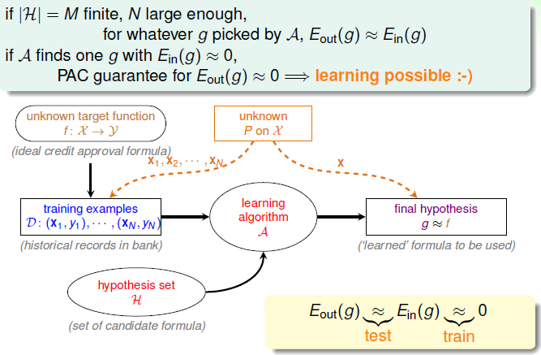
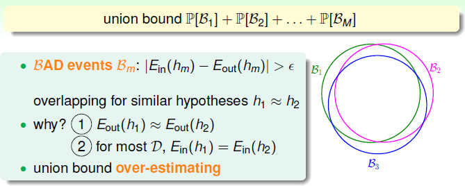
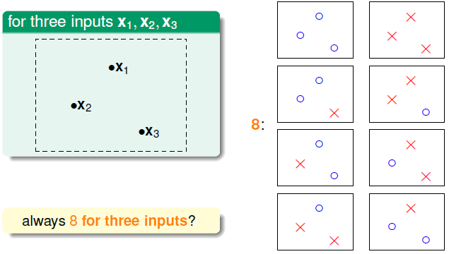
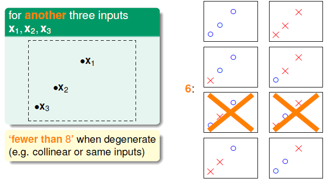
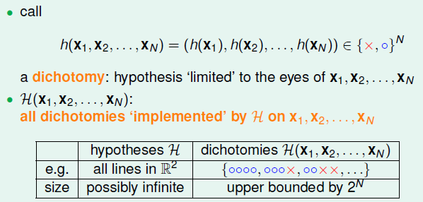
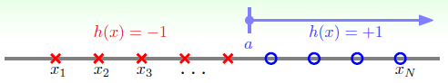
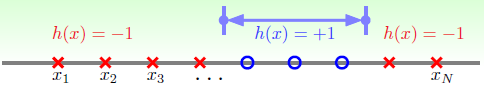
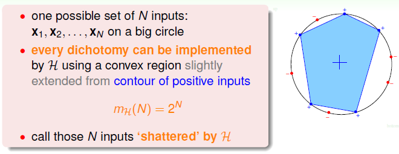
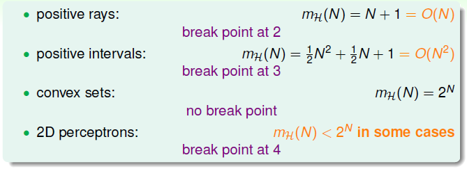

# Training versus Testing

上节课介绍了机器学习的可行性。从 NFL 定理得出机器学习貌似不可行，随后又引入了统计学，如果样本容量足够大，且假设个数有限，那么机器学习一般是可行的。最后留下了一个问题，当假设无限多（如 PLA）时，机器学习的可行性是否依然成立？

### 回顾和预览

回顾基于统计学的机器学习流程图：

要求训练集 $\mathcal{D}$ 和测试集来自同一分布，训练集足够大，假设集有限，才能保证演算法选出的 $g$ 有很好的泛化能力。通过训练，得到使 $E_{in}$ 最小的 $h$，作为模型最终生成的 $g$，满足 $g\approx f$。

回顾前四节的主要内容：

- 首先介绍了机器学习的定义，明确机器学习是要找出最好的 $g$，满足 $g\approx f \Longleftrightarrow E_{out}(g) \approx 0$。
- 接下来介绍了感知器模型，使用 PLA、Pocket 等演算法在数据集中选出$E_{in}\approx 0$ 的 $g$。
- 然后介绍了机器学习的分类，机器学习的核心问题是批量（batch）、监督式（supervised）的二元分类（binary classification）问题。
- 最后在运用统计学知识，将 $E_{in}(g)$ 与 $E_{out}(g)$ 联系起来，证明了在一些条件下，$E_{in}(g)\approx E_{out}(g)$ 成立。

也就是我们把机器学习分成两个核心问题：

- $E_{in}(g)\approx E_{out}(g)$
- 让 $E_{in}(g)$ 足够小

$M = |\mathcal{H}|$ 是假设集的大小， $M$ 很小时，根据 Heoffding’s Inequality，得到 $E_{in}(g)\approx E_{out}(g)$，即第一个问题解决，但是 $M$ 很小意味着演算法 $\mathcal{A}$ 可选择的假设有限，不一定能够找到使 $E_{in}(g)$ 足够小的假设，即无法解决第二个问题。当 $M$ 很大时，演算法可选择的假设更多，容易找到使 $E_{in}(g)$ 足够小的假设，但是很可能出现 Bad Data，即 $E_{in}(g)$ 与 $E_{out}(g)$ 相差可能很大。

可见，假设集大小 $M$，直接影响了两个核心问题能否解决。但 PLA 的待选直线有无数条，但 PLA 可以很好地进行机器学习。我们已知由布尔不等式 $\mathbb{P}(\underset{i}{\bigcup}A_i) \leq \underset{i}{\sum}\mathbb{P}(A_i)$ 可推导出：
$$
\mathbb{P}[|E_{in}(g)-E_{out}(g)| > \epsilon ] \leq 2\cdot M\cdot \exp(-2\epsilon^2N)
$$
我们要把 $M$ 换成一个有限的 $m_{\mathcal{H}}$：
$$
\mathbb{P}[|E_{in}(g)-E_{out}(g)| > \epsilon] \overset{?}{\leq} 2\cdot m_{\mathcal{H}} \cdot \exp(-2\epsilon^2N)
$$
如果可以替换，就可以证明机器学习对于无限大假设集的可行性。研究 $m_{\mathcal{H}}$ 以选取正确的假设集。经过接下来的几节课，我们将彻底地解释为什么 PLA 可以有效地解决机器学习问题。

### 有效直线数

回顾由 Heoffding Inequality 推导出的：
$$
\mathbb{P}[|E_{in}(g)-E_{out}(g)| > \epsilon ] \leq 2\cdot M\cdot \exp(-2\epsilon^2N)
$$

- BAD events  $\mathcal{B_m}$：$|E_{in}(h_m) - E_{out}(h_m)| > \epsilon$

- 演算法 $\mathcal{A}$ 可自由选择的概率：$\mathbb{P}[\mathcal{B_1}\or \mathcal{B_2} \or ... \mathcal{B_M}]$

- 最坏的情况下即 $\mathcal{B_m}$ 间没有交集，以级联形式得到：
  $$
  \mathbb{P}[\mathcal{B_1}\or \mathcal{B_2} \or ... \mathcal{B_M}] \leq \mathbb{P}[\mathcal{B_1}] + \mathbb{P}[\mathcal{B_2}] + ... + \mathbb{P}[\mathcal{B_M}]
  $$

可见，当 $M = \infty$ 时，不等式右边会很大，似乎说明 BAD events 很大，但级联的形式实际上扩大了上界。这是在最坏情况下，即 $\mathcal{B_m}$ 不相交，但实际上，对于类似的假设，$\mathcal{B_m}$ 会有很大部分的相交。这就导致了级联的上界估计过高。所以我们找出 $\mathcal{B_m}$ 的重叠部分，也就是将无数个假设分为有限个类别。

考虑假设集 $\mathcal{H}$ 为 $\mathbb{R}^2$ 上的直线，即 $M=\infty$。对于一个输入 $\mathbf{x_1}$，根据直线对 $\mathbf{x_1}$ 的分类结果不同分成两类。两个输入为 4 类，三个输入时如下，可以达到 8 类：

但并不0是总是可分成 8 类，对于共线的三个输入，会出现线性不可分的情况：

只要输入的数据对应的输出情况是线性可分的，就对应一类直线。 

经过分析，得出：平面上线的种类是有限的，对于输入点个数 $N$，有效直线数即可划分出的最大种类数总是满足 $effective(N) \leq 2^N$。因此可以使用 $effective(N)$ 替代 $M$，不等式转换为：
$$
\mathbb{P}[|E_{in}(g)-E_{out}(g)| > \epsilon ] \leq 2\cdot effective(N)\cdot \exp(-2\epsilon^2N)
$$
已知 $effective(N) \leq 2^N$，如果有 $effective(N) \ll 2^N$，即不等式右边接近零，那么即使 $M=\infty$ ，直线的种类有限，机器学习是可行的。

### 有效假设数

 假设集 $\mathcal{H}=\{hypothesis h:\mathcal{X}\rightarrow \{\times,\circ\}\}$，引入定义 dichotomy（二分）：
$$
h(\mathbf{x_1},\mathbf{x_2},...,\mathbf{x_N}) = (h(\mathbf{x_1}),h(\mathbf{x_2}),...,h(\mathbf{x_N})) \in \{\times,\circ\}^N
$$
以二维平面为例，dichotomy  $h(\mathbf{x_1},\mathbf{x_2},...,\mathbf{x_N})$ 就是将空间中的点分为两类的直线，其与假设集 $\mathcal{H}$ 的关系是：$\mathcal{H}$ 是平面上所有直线的集合，个数可能是无数个；而dichotomy $\mathcal{H}(\mathbf{x_1},\mathbf{x_2},...,\mathbf{x_N})$ 是平面上能将点分类的直线种类，其个数上界为 $2^N$。接下来要做的就是用 $|\mathcal{H}(\mathbf{x_1},\mathbf{x_2},...,\mathbf{x_N})|$ 来替换 $M$。

可以看到，$|\mathcal{H}(\mathbf{x_1},\mathbf{x_2},...,\mathbf{x_N})|$ 显然与输入相关，为了移除对输入的依赖，那么计算输入空间可能的 $|\mathcal{H}(\mathbf{x_1},\mathbf{x_2},...,\mathbf{x_N})|$ 的最大值，称为成长函数：
$$
m_{\mathcal{H}}(N) = \underset{\mathbf{x_1},\mathbf{x_2},...,\mathbf{x_N}\in \mathcal{X}}{\max} |\mathcal{H}(\mathbf{x_1},\mathbf{x_2},...,\mathbf{x_N})|
$$
显然，$m_{\mathcal{H}(N)} \leq 2^N$，下面讨论如何计算成长函数，先看一个简单的假设集，一维的正向射线：

$N$ 个点将整个区域分为 $N+1$ 段，由此容易得到成长函数 $m_{\mathcal{H}} = N+1$，当 $N$ 很大时，有 $(N+1)\ll 2^N$，这正是我们想要的。

看另一个假设集，一维区间：

其成长函数也比较容易计算：
$$
\begin{align}
m_{\mathcal{H}}(N)	&= \underbrace{\binom{N+1}{2}}_{interval\ ends\ in\ N+1\ spots} + \underbrace{1}_{all\ \times} \\
					&= \frac{1}{2} N^2 + \frac{1}{2} N+1 \ll 2^N
\end{align}
$$
当 $N$ 很大时，同样满足条件。

再看下一个例子，假设集为二维平面上的凸集（即集合内任一一对点的连线也在集合中），那么它的成长函数是多少呢？

如果可以找到一组可成圆分布的输入点，$N$ 个点所有可能的分类都有对应的凸多边形，最后得到成长函数 $m_{\mathcal{H}} = 2^N$，这样的输入点称为可分割的。

### 断点

 上面介绍了四种不同的成长函数，分别是：

- 射线：$m_{\mathcal{H}}(N)=N+1$
- 区间：$m_{\mathcal{H}}(N)=\frac{1}{2} N^2 + \frac{1}{2} N+1$
- 凸集：$m_{\mathcal{H}}(N)=2^N$  
- 二维感知器：$m_{\mathcal{H}}(N)<2^N$

对于前两种多项式的成长函数，用其代替 $M$ 的效果比较好，而以指数的成长函数，并不能保证机器学习的可行性。对于二维平面的直线，我们还不知道它的成长函数是多项式还是指数的。

对于二维平面的直线，之前已经计算了，对于 3 个点，可以做出 8 种的 dichotomy，而 4 个点无法做出所有 16 个 dichotomy。所以将 4 作为二维感知器的断点。如果点个数 k 大于等于断点时，它的成长函数一定小于 $2^k$。以此求出四种成长函数的断点：

射线的断点为 2，对应成长函数数量级为 $O(N)$；区间的断点为 3，对应数量级 $O(N^2)$。由此猜测，成长函数断点 k，对应其数量级为 $O(N^{k-1})$。如果成立， 就可以用 $m_{\mathcal{H}}$ 代替 $M$，可以证明机器学习的可行性。