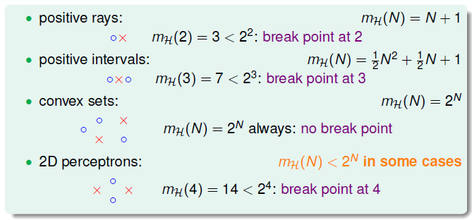
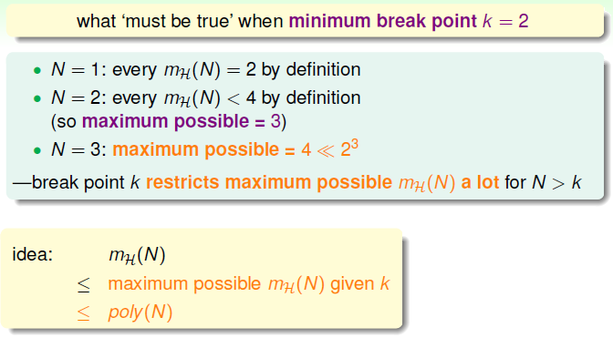
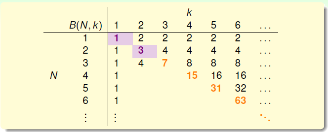
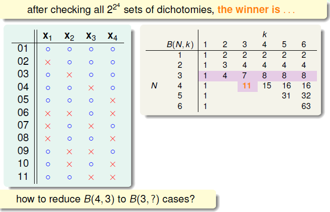
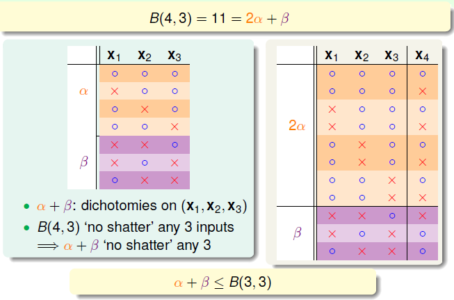
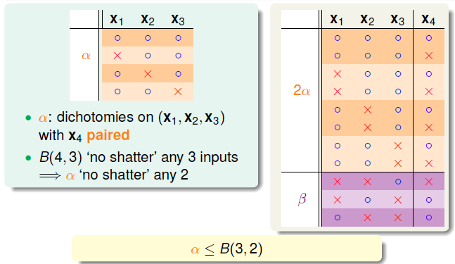
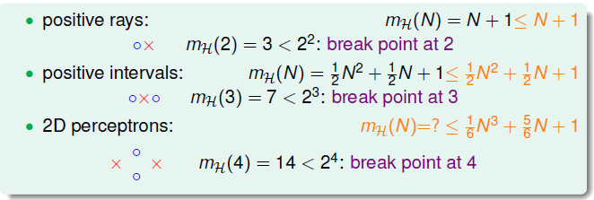

# Theory of Generalization

上节课讨论了假设集大小 $M$ 对机器学习的影响。当 $M$ 很大时，无法保证机器学习的可行性，因此引入成长函数 $m_{\mathcal{H}}(N)$、dichotomy 以及断点的概念，提出二维感知器的成长函数是多项式级别的假设，本节将就此深入探讨。

### 断点限制

回顾上节课的四种成长函数及其断点：

  对于一个断点为 2 的假设集，$N$ 取不同值的成长函数是多少。很明显，当 $N=1$ 时，$m_{\mathcal{H}}(N) = 2$ ；当 $N=2$ 时，$m_{\mathcal{H}}(N) < 4$，任意两点都不能被分割；当 $N=3$ 时，可以自己列出各种 dichotomy 的情况，验证是否满足断点为 2 的条件，最后得到 $m_{\mathcal{H}}(N)=4$，即最多只有 4 种 dichotomy。

由此，我们发现，断点限制了成长函数的大小。如果给定 $N$ 和 $k$，能够证明 $m_{\mathcal{H}}(N)$ 的上界是多项式，那么就可以用成长函数代替 $M$，证明机器学习的可行性。因此哦我们的目标就是证明 $m_{\mathcal{H}}(N)$ 的上界是 $\rm poly(N)$。

### 上界函数：基本情况

引入上界函数 $B(N,k)$，表示断点为 $k$ 时，成长函数可能的最大值。对应 $m_{\mathcal{H}}(N)$ 最多有多少种 dichotomy。上界的引入不考虑假设集具体是什么，以及成长函数到底是怎样的，而只关心成长函数的上界是多少。dichotomy 表示为长度为 $N$ 的向量，需要满足其中任意长度为 $k$ 的子向量都没有 $2^k$ 种组合即不可分割。因此，证明的目标变为：
$$
B(N,k) \leq \rm poly(N)
$$
求解 $B(N,k)$ 的过程就是填表的过程：

- $k=1,\ B(N,k)\equiv 1$
- $N<k,\ B(N,k)=2^N$
- $N = k,\ B(N.k)=2^N-1$

由此，表格填完一半了，对于常见的 $N>k$ 的情况比较复杂，接下来将进行推导。

### 上界函数：归纳

以求解 $B(4,3)$ 为例，$B(4,3)$ 应该是 $B(3,?)$ 加了一个点产生的。我们要做的就是找出其中的关系，将 $B(4,3)$ 减到 $B(3,?)$。

遍历 $B(4,3)$ 对应的所有 dichotomy 集合，得到 最大的集合有 11 个 dichotomy，因此 $B(4,3)=11$。

下面我们要把 $B(4,3)$ 与 $B(3,?)$ 建立联系，我们把得到的 11 个 dichotomy 分组，分为橙色和紫色。橙色的是 $\mathbf{x_1}, \mathbf{x_2}, \mathbf{x_3}$ 相同而 $\mathbf{x_4}$ 不同成对，紫色是单一的。于是，$B(4,3)$ 可以表示为两种颜色相加的结果，从 4 维向量 dichotomy 中提取出用于分类的 3 维子向量 $(\mathbf{x_1},\mathbf{x_2},\mathbf{x_3})$，橙色为 $\alpha$，紫色为 $\beta$。就得到 $B(4,3)=2\alpha + \beta$。根据定义，断点为 3，即 3 维子向量不可切割，则有 $\alpha+\beta \leq B(3,3)$。

同时，$\alpha$ 中是 $\mathbf{x_4}$ 成对存在的，且 $\alpha$ 是任意 3 点不可切割的，那么能推导出 $\alpha$ 是不能被任意 2 点切割的，否则 $\mathbf{x_1}，\mathbf{x_2}，\mathbf{x_3}，\mathbf{x_4}$ 组成的 dichotomy 就会有 3 个点可切割。这也是分组的原因，由此可推导出 $\alpha \leq B(3,2)$。

到此，可推导出以下：
$$
\begin{align}
B(4,3)	&= 2\alpha + \beta \\
\alpha + \beta &\leq B(3,3) \\
\alpha &\leq B(3,2) \\
\Longrightarrow B(4,3) &\leq B(3,3) + B(3,2)
\end{align}
$$
可推导出一般公式为：
$$
B(N,k) \leq B(N-1,k) + B(N-1,k-1)
$$
根据此不等式可以完成 $B(N,k)$ 表，得到上限的上限：
$$
B(N,k) \leq \sum_{i=0}^{k-1}\binom{N}{i}
$$
不等式的右侧是最高为 $k-1$ 阶的 $N$ 多项式，得到我们想要的结果，断点存在的成长函数的上界满足多项式分布。现在再回头看之前介绍的几种成长函数与断点之间的关系：

### 证明

我们已经知道了有断点的成长函数的上界是 $\rm poly(N)$ 的，如果能用 $m_{\mathcal{H}}(N)$ 代替 $M$，代入 Heoffding’s 不等式中，就能得到 $E_{in}\approx E_{out}$ 的结论：

$$
\mathbb{P}[\exists h \in \mathcal{H}\ {\rm s.t.}\ |E_{in}(h)-E_{out}(h)| > \epsilon] \leq 2\quad m_{\mathcal{H}}(\quad N)\cdot \exp(-2\quad \epsilon^2N)
$$
但实际上我们无法简单地替换，当 $N$ 足够大时，正确的表达式为：
$$
\mathbb{P}[\exists h \in \mathcal{H}\ {\rm s.t.}\ |E_{in}(h)-E_{out}(h)| > \epsilon] \leq 2\mathbf{\cdot 2}m_{\mathcal{H}}(\mathbf{2}N)\cdot \exp(-2\mathbf{\frac{1}{16}} \epsilon^2N)
$$
不等式的证明比较复杂，分为 3 个步骤对应增加的 3 个常数：

- $E_{in}$ 是有限的，而 $E_{out}$ 是无限的，我们首先要替换掉 $E_{out}$。替换为有限个，则用样本容量为 $N$ 的验证数据集 $\mathcal{D'}$，计算其上的 $E_{in}'$。当 $E_{in}$ 与 $E_{out}$  相差较大时，有很大的概率 $E_{in}$ 和 $E_{in}'$ 相差很大。
  $$
  \mathbf{\frac{1}{2}}\mathbb{P}[\exists h \in \mathcal{H}\ {\rm s.t.}\ |E_{in}(h)-E_{out}(h)| > \epsilon] \\
  \leq \mathbb{P}[\exists h \in \mathcal{H}\ {\rm s.t.}\ |E_{in}(h)-\mathbf{E_{in}'(h)}| > \mathbf{\frac{\epsilon}{2}}]
  $$
  由此通过对 ghost Data 的验证去掉了无限大的 $E_{out}$。
  
- 在数据集 $\mathcal{D}$ 和验证集 $\mathcal{D'}$ 中，无限的假设集最多可以分成 $m_{\mathcal{H}}(2N)$ 类，于是可以使用级联上界：
  $$
  \begin{align}
  BAD 	&\leq \mathbf{2}\mathbb{P}[\exists h \in \mathcal{H}\ {\rm s.t.}\ |E_{in}(h)-\mathbf{E_{in}'(h)}| > \mathbf{\frac{\epsilon}{2}}] \\
  		&\leq \mathbf{2}m_{\mathcal{H}}(\mathbf{2N})\mathbb{P}[{\rm fixed}\ h\ {\rm s.t.}\ |E_{in}(h)-\mathbf{E_{in}'(h)}| > \mathbf{\frac{\epsilon}{2}}]
  \end{align}
  $$
  这里其实没看太明白。。。

- 对于固定的假设，两个样本的差别，就等同于对于 $2N$ 个样本，选出 $N$ 个计算 $E_{in}$ ，剩下的计算 $E_{in}'$：
  $$
  |E_{in}-E_{in}'|>\frac{\epsilon}{2} \Leftrightarrow |E_{in} - \frac{E_{in}+E_{in}'}{2}| > \frac{\epsilon}{4}
  $$
  即比较选出的部分和总体的差别，应用 Heoffding：
  $$
  \begin{align}
  BAD &\leq \mathbf{2}m_{\mathcal{H}}(\mathbf{2N})\mathbb{P}[{\rm fixed}\ h\ {\rm s.t.}\ |E_{in}(h)-\mathbf{E_{in}'(h)}| > \mathbf{\frac{\epsilon}{2}}] \\
  	&\leq \mathbf{2}m_\mathcal{H}(\mathbf{2N})\cdot \exp(-2(\mathbf{\frac{\epsilon}{4}})^2 N)
  \end{align}
  $$

经过以上的三个步骤，得到了 Vapnik-Chervonenkis  上界：
$$
\mathbb{P}[\exists h \in \mathcal{H}\ {\rm s.t.}\ |E_{in}(h)-E_{out}(h)| > \epsilon] \\ 
\leq \mathbf{4}m_{\mathcal{H}}(\mathbf{2N})\cdot \exp(-\frac{1}{8}\epsilon^2N)
$$
到此，我们得出：对于二维感知器，断点为 4，成长函数 $m_{\mathcal{H}}(N) = O(N^3)$。即只要选择使 $E_{in}\approx 0$ 的假设，就能保证 $E_{in}\approx E_{out}$，运用 PLA 的机器学习可行。