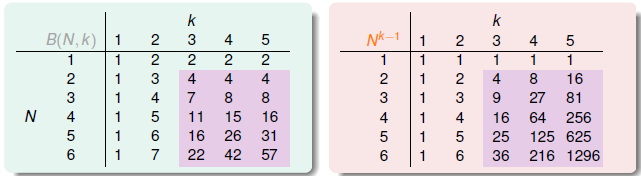
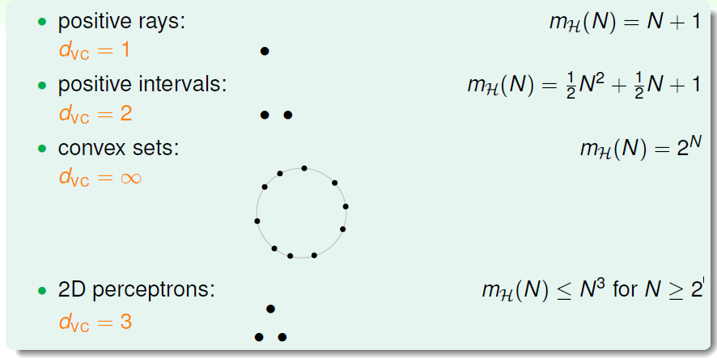
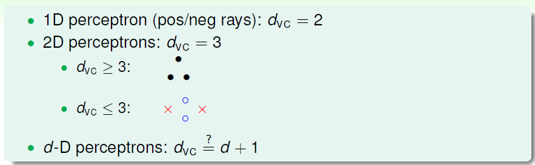
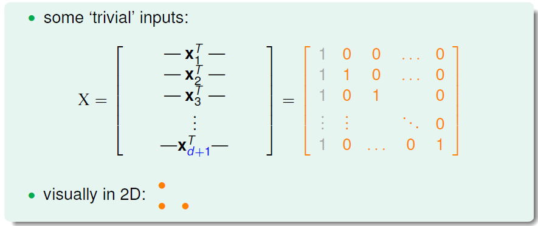
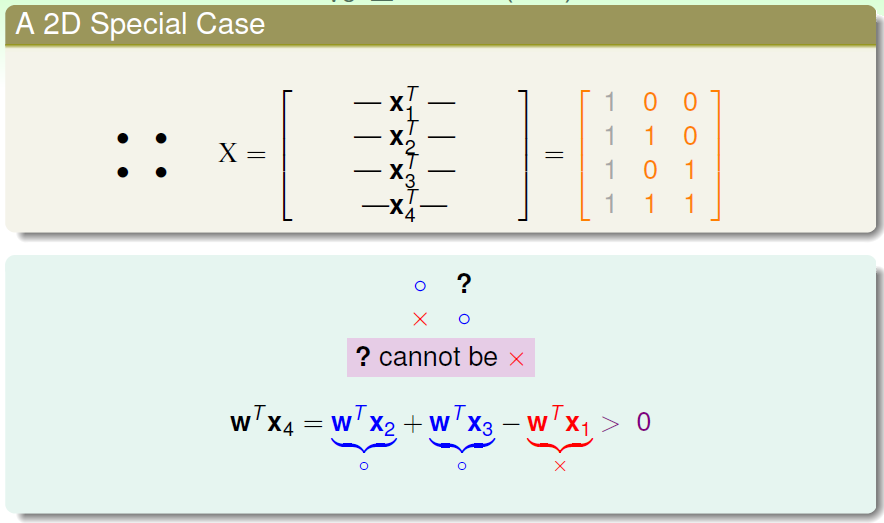
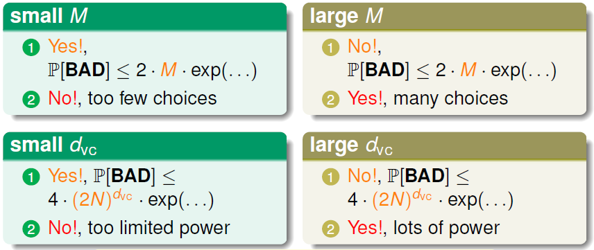
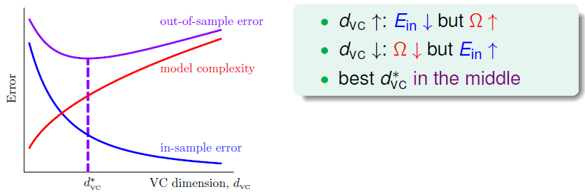
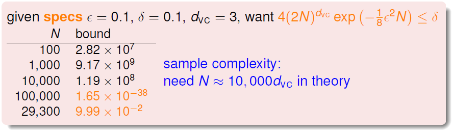

# The VC Dimension

前几节课介绍并推导了机器学习的可行性，引入统计学知识并得出机器学习可行性的两个关键问题：

- $E_{in}(g)\approx E_{out}(g)$
- $E_{in}(g)\approx 0$

为了解决假设集大小 $M=\infty$ 时很可能出现 Bad Data 的问题，我们根据训练集对假设进行分类，并用成长函数 $m_{\mathcal{H}}(N)$ 代替 $M$，且证明了只要断点存在，成长函数的上界 $B(N,k)$ 是 $N$ 的 $k-1$ 阶多项式级别。通过三步证明，推导出 VC bound，机器学习可行。

### VC 维度的定义

假设集 $\mathcal{H}$ 存在断点，那么其成长函数存在上界即 $B(N,k)$ 。经过数学归纳法，我们得到 $B(N,k) = \sum_{i=0}^{k-1}\binom{N}{i}$。从下表可以看出，对于 $N\geq 2,k\geq 3$，$m_\mathcal{H}(N) \leq B(N,k) \leq N^{k-1}$ :

上节课我们推导出 VC bound，根据此结论再进一步扩大上限：
$$
\begin{align}
&\mathbb{P}_{\mathcal{D}}[|E_{in}(g)-E_{out}(g)|>\epsilon] \\
\leq\quad 	&\mathbb{P}_{\mathcal{D}}[\exists h\in \mathcal{H}\ {\rm s.t.}\ |E_{in}(h)-E_{out}(h)|>\epsilon] \\
\leq\quad	&4m_{\mathcal{H}}(2N)\exp(-\frac{1}{8}\epsilon^2N) \\
\overset{\exists\ k}{\leq}\quad 	&4(2N)^{k-1}\exp(-\frac{1}{8}\epsilon^2N)
\end{align}
$$
最终我们得到的不等式只与 $k$ 和 $N$ 相关，证明 VC bound 的过程中已经假设 $N$ 足够大， 所以我们要考虑的是 $k\geq 3$。

由此，我们就出结论：

- 假设集 $\mathcal{H}$ 的成长函数存在断点，且训练集足够大，那么可以保证算法有很好的泛化能力，即 $E_{out}\approx E_{in}$
- 演算法 $\mathcal{A}$ 从假设集中能选出使 $E_{in}$ 足够小的 $g$ ，那么机器学习可行。

下面给出 VC 维度的定义，VC 维度就是假设集中最大的非断点，即假设集 $\mathcal{H}$ 的 VC 维度 $d_{VC}(\mathcal{H})$ 是成长函数满足 $m_{\mathcal{H}}=2^N$ 的最大输入个数。易得 $d_{VC} = k-1$，那么上面这个推论的条件就变成了 $N\geq 2,d_{VC} \geq 2 \Rightarrow m_{\mathcal{H}}(N)\leq N^{d_{VC}}$。

有了 VC 维度的定义，回顾之前的四种假设集的情况：

用 $d_{VC}$ 代替断点，那么 VC bound 的问题就转换成与 $N$ 和 $d_{VC}$ 相关。如果一个假设集的 $d_{VC}$ 确定，那么就满足机器学习可行性的第一个条件 $E_{out}\approx E_{in}$。这与演算法、输入样本分布以及目标哈数都无关。

### 感知器的 VC 维度

回顾最开始学习的二维空间 PLA 算法，首先要保证训练集线性可分，即经过足够多次修正后 PLA 可以停下来，得到 $E_{in}(g)=0$。$d_{VC} =3$，在数据集足够大的情况下，可以确保 $E_{in}\approx E_{out}$，这与数据分布和目标函数无关。于是能够得出 $E_{out}(g)\approx 0$，机器学习可行。那么对于多维的感知器，又是否可行呢？

一维感知器，即正向或负向的射线，$d_{VC}=2$，二维感知器 $d_{VC}=3$，那么我们可以做出假设，$d$ 维感知器，有 $d_{VC}=d+1$。

要证明这一假设，分两步进行：

- $d_{VC}\geq d+1$： 根据 VC 维度的定义，就是要证明找到 $d+1$ 个输入可以 shattered，也就是所有$2^{d+1}$ 情况都可列出。接下来就构造满足条件的矩阵 $X$ 即可，$d+1$ 个 $d$ 维的输入，再加上添加的 $x_0$，就得到：

  

  显然矩阵 $X$ 是可逆的。所谓 shatter，就是对于任意一个输出集 $\mathbf{y}$，都可以找到对应的 $\mathbf{w}$，使得 $\rm sign(X\mathbf{w}) = \mathbf{y} \Leftarrow (X\mathbf{w})=\mathbf{y} \overset{\rm X\ invertible}{\Longleftrightarrow} \mathbf{w} = X^{-1}\mathbf{y}$。也就证明了 $d_{VC} \geq d+1$。

- $d_{VC} \leq d+1$：即证明对于任意的 $d+2$ 个输入，一定不能被 shattered。首先看二维的情况，4 个输入构成了如下的矩阵，4 个 3 维向量一定是线性相关的，那么我们就可以得到：

  

  即输入之间的线性依赖限制了 dicotomy 的数量。放到 $d$ 维里，同样，$d+2$ 个输入必定线性相关，即：
  $$
  \mathbf{x_{d+2}} = a_1\mathbf{x_1}+a_2\mathbf{x_2}+...+a_{d+1}\mathbf{x_{d+1}}
  $$
  系数 $a_i$ 不全为 0。那么如果有一个 $\mathbf{w}$，对 $d+1$ 个输入产生的输入一致，就有：
  $$
  \mathbf{w^Tx_{d+2}} = a_1\mathbf{w^Tx_1}+a_2\mathbf{w^Tx_2}+...+a_{d+1}\mathbf{w^Tx_{d+1}} > 0
  $$
  也就是无法产生 $\mathbf{w} = (\rm sign(a_1),sign(a_2),...,sign(a_{d+1}),\times)$ 的情形，即 $d+2$ 个输入不可shattered，$d_{VC} \leq d+1$。

综上，证明了 $d_{VC} = d+1$。

### VC 维度的物理直觉

$d_{VC} = d+1$ 将 VC 维度和感知器的维度联系起来，对应假设集中的 $\mathbf{w}=(w_0,w_1,...,w_d)$ 中的自由参数。假设集大小 $M=|\mathcal{H}|$ 类比于自由度，那么 VC 维度就是对二元分类有效的自由度，体现假设集的分类能力，即产生 dichotomy 的数量。正向射线的假设集，其自由度为 1，而区间的自由度为 2，即 VC 维度大致与自由参数个数相等，但并不总相等。可以用自由度估计假设集的 VC 维度。

之前分析过假设集大小 $M$ 的对机器学习可行性两个问题的影响，即 $M$ 小，有利于 $E_{in}\approx E_{out}$ 而不利于选出 $E_{in}(g) \approx 0$，$M$ 大，有利于选出 $E_{in}(g)\approx 0$，但不能保证 $E_{in}\approx E_{out}$。现在有了 VC 维度，其实 $d_{VC}$ 对这两个问题的影响与 $M$ 基本一致，VC 维度同样是选择假设集的重要因素。

### 解释 VC 维度

引入 VC 维度后，VC bound 可写成以下的形式：
$$
\mathbb{P}_{\mathcal{D}}[\underbrace{|E_{in}(g)-E_{out}(g)|>\epsilon}_{\textbf{BAD}}] \leq \underbrace{4(2N)^{d_{VC}}\exp(-\frac{1}{8}\epsilon^2N)}_\delta
$$
坏事情发生的概率不超过 $\delta$，也就是好事情 $|E_{in}-E_{out}| \leq \epsilon$ 发生的概率很大：
$$
\begin{align}
\delta	&= 4(2N)^{d_{VC}}\exp(-\frac{1}{8}\epsilon^2N) \\
\Rightarrow\quad \epsilon&=\sqrt{\frac{8}{N}\ln(\frac{4(2N)^{d_{VC}}}{\delta})}
\end{align}
$$
$\epsilon$ 越小表示泛化能力越大，有很大概率 $E_{in}$ 和 $E_{out}$ 的差距会被限制在 $\epsilon$ 内：
$$
{\rm gen. error}\ |E_{in}(g)-E_{out}(g)| \leq \sqrt{\frac{8}{N}\ln(\frac{4(2N)^{d_{VC}}}{\delta})} \\
E_{in}(g) - \sqrt{\frac{8}{N}\ln(\frac{4(2N)^{d_{VC}}}{\delta})} \leq E_{out}(g) \leq E_{in}(g) + \sqrt{\frac{8}{N}\ln(\frac{4(2N)^{d_{VC}}}{\delta})}
$$

得出泛化误差的范围，通常我们更关心上界，即：
$$
E_{out}(g) \leq E_{in}(g) + \underbrace{\sqrt{\frac{8}{N}\ln(\frac{4(2N)^{d_{VC}}}{\delta})}}_{\Omega(N,\mathcal{H},\delta)}
$$
$\Omega(N,\mathcal{H},\delta)$ 称为模型复杂度，与数据集大小、假设集和 $\epsilon$ 有关。随着 VC 维度的变化，$E_{in}$、$E_{out}$ 以及模型复杂度会随之变化：

随着 VC 维度的增大，$E_{in}$ 会减小但同时复杂度增大。为了得到最小的 $E_{out}$，无能一味地增加 VC 维度来减小 $E_{in}$，即要选择何时的 $d_{VC}$。

对于选定的 VC 维度，如何选择数据集的数量呢？如下的例子：

可见，理论上需要的数据量是很大的，但实际上往往并不需要这么多的样本，$N\approx 10d_{VC}$ 即可。理论和实际相差这么多是因为 VC bound 过于宽松了，我们得到的是一个比实际大得多的上界。这是因为：

- Hoeffding 不等式，为确保对任意未知的数据分布和目的函数
- 用成长函数 $m_{\mathcal{H}}(N)$ 代替假设集大小，而成长函数是 dichotomy 数量的最大值
- 用 $N^{d_{VC}}$ 代替成长函数，上限的上限的上限，确保只针对假设集的 VC 维度即可
- 使用了 union bound，包括了最坏的情况

VC bound 比较宽松，很难缩紧，比较好的一点是，VC bound 对所有模型的宽松程度是差不多的。所以还是可以比较不同的模型。

目前讨论的都是无噪音的二元分类问题，下一节将尝试将 VC 维度的概念延伸到不同的机器学习问题中。