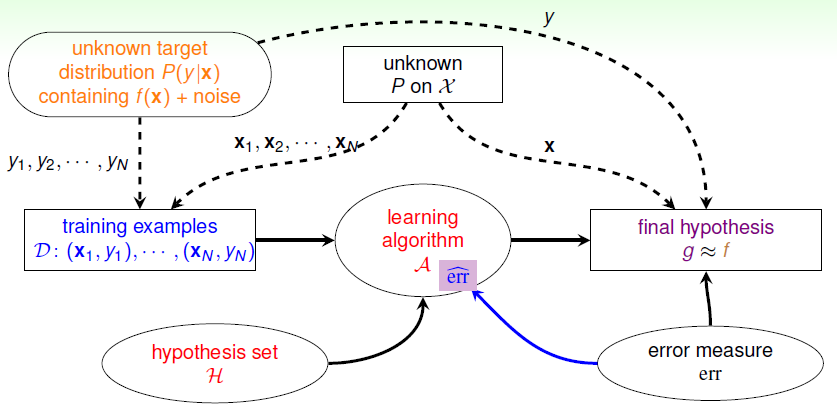

# Noise and Error

上节课引入了 VC 维度得概念，得出结论，如果假设集的 VC 维度有限，数据集足够大，同时能找到满足 $E_{in}\approx 0$ 的假设，那么机器学习可行。本节课主要介绍对于数据集有噪声时的机器学习问题。

### 噪声和概率目标

数据集中的噪声一半有三种情况：

- 分类错误，人为等原因误分
- 同样特征的输入被分为不同类
- 错误的输入特征

回顾最开始引入的例子，估计罐子中橙色球的比例，之前的推导都是运用统计学知识。橙色表示假设与目标函数结果不一致的情况，但是引入噪声后，数据集中的分类结果并不一定与目标函数的结果相同，由确定分布转换成概率分布 $P(y|\mathbf{x})$。可以证明如果概率分布的数据集仍是独立同分布的，之前的机器学习方法依然奏效，即通过抽样估计整体。

$P(y|\mathbf{x})$ 称为目标分布，它实际上告诉我们对每个点 $\mathbf{x}$ 的预测目标是什么。选择最优预测作为理想的目标，其余则是噪声。之前目标函数固定的确定分布，也可看作特殊情况的目标分布。

于是机器学习的目标转换为：

- 由 $P(\mathbf{x})$ 确定的经常出现的重要的点
- 由 $P(y|\mathbf{x})$ 确定的理想预测目标 mini-target

引入噪声的情况下，新的机器学习流程如下：

训练集和验证集都来自同一概率分布。 

### 误差度量

机器学习最终要考虑的问题就是生成函数与目标函数的接近程度，我们一直使用 $E_{out}(g)=\underset{\mathbf{x}\sim P}{\mathcal{E}}[[g(\mathbf{x}) \neq f(\mathbf{x})]]$ 进行误差估计。对 $g$ 的误差度量一半有三个特性：

- 样本外的未知数据
- 对每个点都可度量
- 分类错误，预测和目标是否一致，$0/1$ 误差

逐点的误差度量就是对样本外的每个点计算误差并计算平均：
$$
E(g,f) = E_{out}(g) = \underset{\mathbf{x}\sim P}{\mathcal{E}}\underbrace{[[g(\mathbf{x}) \neq f(\mathbf{x})]]}_{{\rm err}(g(\mathbf{x}),f(\mathbf{x}))}
$$
 得到 $E_{in}$ 和 $E_{out}$ 的表达式为：
$$
\begin{align}
{\rm in\ sample:}\quad &E_{in}(g)=\frac{1}{N}\sum_{n=1}^N {\rm err}(g(\mathbf{x_n}),f(\mathbf{x_n})) \\
{\rm out\ of\ sample:}\quad &E_{out}(g)=\underset{\mathbf{x}\sim P}{\mathcal{E}}{\rm err}(g(\mathbf{x}),f(\mathbf{x})) \\
\end{align}
$$
简单起见，我们主要考虑逐点的误差度量方式。一般分为两类：$0/1$ 误差和方差，前者通常用于分类问题，而方差通常用在回归问题上。
$$
{\rm err}\lgroup \underbrace{g(\mathbf{x})}_{\tilde{y}},\underbrace{f(\mathbf{x})}_y\rgroup \\
\begin{align}
0/1\ {\rm error:}\quad {\rm err}(\tilde{y},y) = [[\tilde{y}\neq y]] \\
{\rm squared\ error:}\quad {\rm err}(\tilde{y},y) = (\tilde{y} - y)^2
\end{align}
$$
期待得到的预测 mini-target 由 $P(y|\mathbf{x})$ 和 $\rm err$ 共同决定，对于不同的误差度量方法，mini-target 的计算方法不同。$0/1$ 误差的计算是取 $P(y|\mathbf{x})$ 最大的一类，而方差是取所有类的加权平方和：
$$
\begin{align}
{\rm 0/1\ error:}\quad &f(\mathbf{x}) = \underset{y \in \mathcal{Y}}{\rm argmax} P(y|\mathbf{x}) \\
{\rm squared\ error:}\quad &f(\mathbf{x}) = \sum_{y\in \mathcal{Y}}y\cdot P(y|\mathbf{x})
\end{align}
$$
通过误差度量，可以知道演算法选择的 $g$ 是否满足预期，以此修正演算法，得到与目标函数更接近的 $g$。

### 算法误差度量

以指纹识别为例，输入是指纹信息，输出判断是否是本人。此时有两种错误，错误接收即把负分为正，错误拒绝即把正分为负。之前的 $0/1$ 误差将两种错误统一为分类错误，但在实际的应用中，两种错误的权重应该不同。如超市优惠，那么错误拒绝的权重应该更大，以避免这种情形；对于安保系统，那么错误接收的权重应该更大，避免越权。

可见，误差度量方法不是唯一的，是由需求决定的。因此，演算法的设计应该加入对应的误差度量方式 $\hat{\rm err}$，真实的 $\rm err$ 一般难以计算，常用的合理情况，对于 $0/1$ 误差，回忆 Pocket 算法，选择最小的错误数量，方差则找出最小的高斯分布噪声。更友好地，易于优化演算法的情况，之后会提到。

### 加权分类

加权分类，即不同的分类错误有不同的权重。赋予不同权重的目的在于减小错误成本，对于安保系统的例子，将错误接收的权重设置很高以避免发生。此时的 $E_{in}$ 表达式为：
$$
E_{in}^{w}(h)=\frac{1}{N} \sum_{n=1}^{N}\{\begin{array}{cc}
{1} & {\text { if } y_{n}=+1} \\
{1000} & {\text { if } y_{n}=-1}
\end{array}\} \cdot[[y_{n} \neq h(\mathbf{x}_{n})]]
$$
目的是让 $E_{in}$ 越小越好，考虑已知的算法，PLA 仅适用于线性可分的数据，Pocket 算法保留犯错最少的结果，那我们或许可以修改 Pocket 算法，不再比较错误个数，而是比较 $E_{in}^w$，最后求出最小的。为了确保这种做法可行，我们需要将 $E_{in}^w$ 和 $E_{in}^{0/1}$ 联系起来。通过如下的复制方式，将原问题转换成等同的可以用 Pocket 算法解决的问题：

      

在设计算法的过程中假设有这种复制的操作，但是实际上我们并不会这样操作。我们可以得到一个新的演算法，以 $E_{in}^w$ 为标准进行替换，同时还要调整设计中被复制的点被访问的概率，经常检查高权重的点是否正确。这种方法可以延伸到其他算法使用。