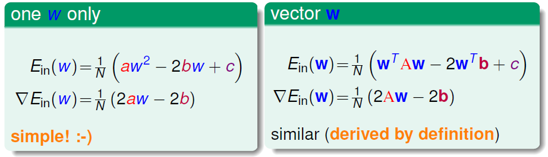
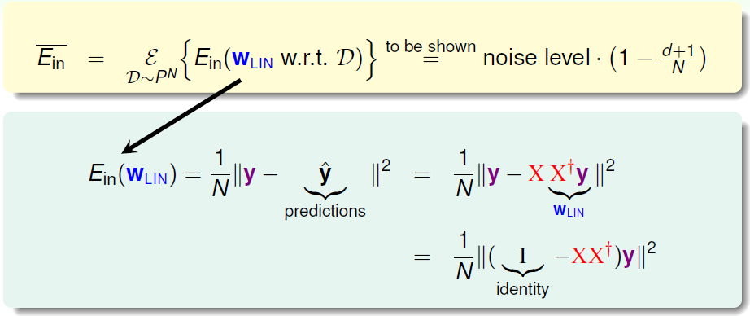
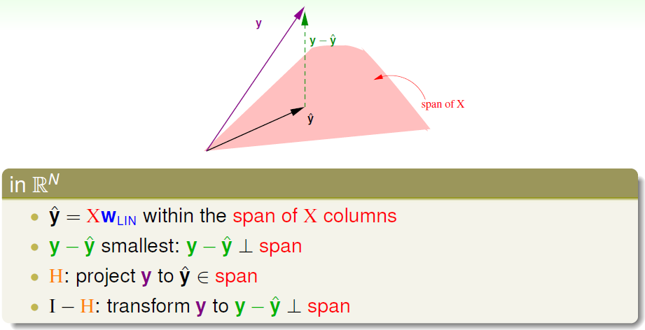
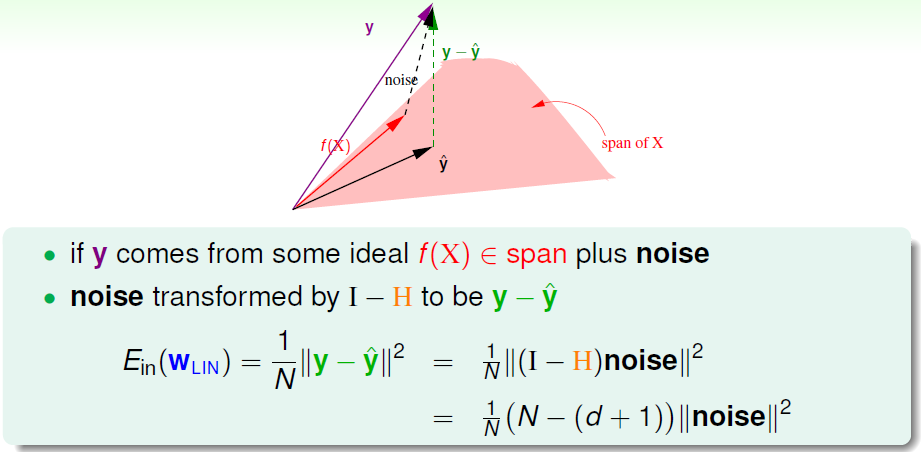
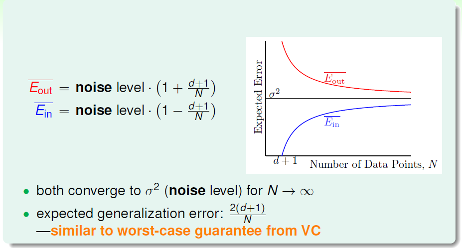
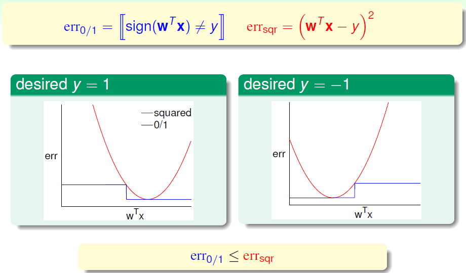

# Linear Regression

上节课主要介绍了 noise 存在的情况下，VC bound 仍然成立，同时介绍了不同的误差度量手段。本节课介绍机器学习最常见的一种算法：线性回归分析。

### 线性回归问题

回顾之前的发放信用卡的问题，本节课仍用这个例子，解决给用户发放信用卡额度的问题。这就是一个线性回归问题。线性回归问题的目标函数值域在整个实数区间。消费者信息是 $d+1$ 维的特征向量 $\mathbf{x}=(x_0,x_1,x_2,...,x_d)$ ，对应的信用卡额度是一个加权和 $y\approx \sum_{i=0}^d w_ix_i$。因此，线性回归的假设可写作 $h(\mathbf{x})=\mathbf{w^Tx}$，这类似于感知器，但是少了符号。线性回归的目标就是找到一条直线或超平面使得样本集中的点更接近它。

线性回归的常用误差度量方式就是基于方差的度量，目标就是算出最小误差对应的权重 $\mathbf{w}$：
$$
{\rm squared\ error:}\quad {\rm err}(\hat{y},y) = (\hat{y}-y)^2 \\
{\rm in\ sample:}\quad E_{in}(\mathbf{w})=\frac{1}{N}\sum_{n=1}^N(\underbrace{h(\mathbf{x_n})}_{\mathbf{w^Tx_n}}-y_n)^2 \\
{\rm out\ of\ sample:}\quad E_{out}(\mathbf{w})=\underset{(\mathbf{x},y)\sim P}{\mathcal{E}}(\mathbf{w^Tx}-y)^2
$$
于是接下来要解决的问题就是确定演算法 $\mathcal{A}$ 以减小 $E_{in}$。

### 线性回归算法

样本数据误差 $E_{in}$ 是权重 $\mathbf{w}$ 的函数，我们的目标就是找出合适的 $\mathbf{w}$，使 $E_{in}$ 尽可能小。首先将计算转换为矩阵的形式：
$$
\begin{align}
E_{in}(\mathbf{w}) &= \frac{1}{N}\sum^N_{n=1}(\mathbf{w^Tx_n}-y_n)^2 = \frac{1}{N}\sum^N_{n=1}(\mathbf{x_n^Tw}-y_n)^2 \\
&= \frac{1}{N}\left\|\begin{array}{c}
{\mathbf{x_1^Tw}-y_1} \\
{\mathbf{x_2^Tw}-y_2} \\
... \\
{\mathbf{x_N^Tw}-y_N}
\end{array}\right\|^{2} \\
&= \frac{1}{N}\left\|\left[\begin{array}{c}
{--\mathbf{x_{1}^{T}}--} \\
{--\mathbf{x_{2}^{T}}--} \\
{...} \\
{--\mathbf{x_{N}^{T}}--}
\end{array}\right] \mathbf{w}-\left[\begin{array}{c}
{y_{1}} \\
{y_{2}} \\
{\cdots} \\
{y_{N}}
\end{array}\right]\right\|^{2} \\
&= \frac{1}{N}\|\underbrace{\mathbf{X}}_{N \times (d+1)}\cdot \underbrace{\mathbf{w}}_{(d+1) \times 1}-\underbrace{\mathbf{y}}_{N \times 1}\|^{2}
\end{align}
$$

我们想要的就是找出 $\underset{\mathbf{w}}\min E_{in}(\mathbf{w})=\frac{1}{N}\|\mathbf{Xw-y}\|^2$，此类线性回归问题的误差是连续、可微的凸函数，我们只要找到梯度为 0 的点也就找到了误差 $E_{in}(\mathbf{w_q})$ 最小的最优解 $\mathbf{w_q}$：
$$
\nabla E_{in}(\mathbf{w}) = \left [ \begin{array}{c}
\frac{\partial E_{in}}{\partial\mathbf{w_0}} \\
\frac{\partial E_{in}}{\partial\mathbf{w_1}} \\
\cdots\\
\frac{\partial E_{in}}{\partial\mathbf{w_d}} \\
\end{array} \right] = \left[\begin{array}{c}0\\0\\...\\0\end{array}\right]
$$
求梯度就是对矩阵求偏导处理：
$$
E_{in}(\mathbf{w}) = \frac{1}{N}\|\mathbf{Xw-y}\|^2 = \frac{1}{N}\left(\mathbf{\underset{A}{w^TX^TXw}-\underset{b}{2w^TX^Ty}+\underset{c}{y^Ty}}\right)
$$

最后计算出样本误差的梯度为：
$$
\nabla E_{in}(\mathbf{w}) = \frac{2}{N}(\mathbf{X^TXw-X^Ty})
$$
令梯度为 0，$\mathbf{X^TXw=X^Ty}$，对于可逆的 $\mathbf{X^TX}$，可以得到权重 $\mathbf{w_q=(X^TX)^{-1}X^Ty}$，其中 $\mathbf{(X^TX)^{-1}X^T}$ 又称为伪逆矩阵，记为 $\mathbf{X^\dagger}$，维度为 $(d+1)\times N$。一般情况下，$N\gg d+1$ 可以保证矩阵可逆。但如果 $\mathbf{X^TX}$ 不可逆，可以通过其他方法定义 $\mathbf{X^\dagger}$ 来计算 $\mathbf{w_q}$。

由此，线性回归算法的流程即：

1. 根据数据集构造输入矩阵 $\mathbf{X}$ 和 输出向量 $\mathbf{y}$。
2. 计算伪逆矩阵 $\underbrace{X^\dagger}_{(d+1)\times N}$。
3. 得到目标权重向量 $\underbrace{\mathbf{w_q}}_{(d+1)\times 1} = \mathbf{X^\dagger y}$。

### 一般化问题

线性回归的算法并没有像 PLA 那样通过迭代一步步减小误差，而是看似直接算出了最优解。那么这样的算法是否属于机器学习算法？一方面，它的是以 closed-form 的解析解形式得出目标权重；而另一方面，小的 $E_{in}$ 通过 VC bound 可以确保小的 $E_{out}$，而且实际上伪逆矩阵的计算过程是迭代的。从结果上看，这种算法的确实现了机器学习的目的。

解析解的好处是比 VC bound 证明方式更简单：

$E_{in}(\mathbf{w_q})$ 经过变换得到 $E_{in}(\mathbf{w_q}) = \frac{1}{N}\|\mathbf{(I-XX^\dagger)y}\|^2=\frac{1}{N}\|\mathbf{(I-H)y}\|^2$，将 $\mathbf{XX^\dagger}$ 写作 $\mathbf{H}$，称为帽子矩阵，因为它让 $\mathbf{y}$ 变成 $\mathbf{\hat{y}}$。

下面从几何角度来看帽子矩阵的物理意义：

如图，$\mathbf{y}$ 是 $N$ 维空间中的一个向量，表示实际的样本数据输出，粉色区域代表 $\mathbf{\hat{y}=Xw_q}$ 所在的空间，表示预测的一种。机器学习的目的就是在粉色空间中找到一个 $\mathbf{\hat{y}}$，使它最接近真实的 $\mathbf{y}$，那么只要将 $\mathbf{y}$ 在空间是作投影即可，投影得到的 $\mathbf{\hat{y}}$ 即为空间内最接近 $\mathbf{y}$ 的向量，这样即可使平均误差 $\overline{E}_{in}$ 最小。

从图中可以看出，$\mathbf{\hat{y}}$ 是 $\mathbf{y}$ 的投影，已知 $\mathbf{\hat{y} = Hy}$，那么 $\mathbf{H}$ 就是表示投影的操作。$\mathbf{y- \hat{y} =(I-H)y}$ 就是将 $\mathbf{y}$ 投影到 $\mathbf{y-\hat{y}}$ 即垂直于粉色区域的操作。

${\rm trace}(\mathbf{I-H})$ 是矩阵的迹，等于矩阵所有特征值之和。

$$
\begin{align}
\rm trace\mathbf{(I-H)} &= \rm trace\mathbf{(I)} - trace\mathbf{(H)} \\
&= N - \rm trace\mathbf{(XX^\dagger)} \\
&= N - \rm trace\mathbf{(X(X^TX)^{-1}X^T)} \\
&= N - \rm trace\mathbf{(X^TX(X^TX)^{-1})} \\
&= N - \rm trace\mathbf{(I_{d+1})} \\
&= N - (d+1)
\end{align}
$$
$\mathbf{I-H}$ 变换的物理意义：原有一个 $N$ 个自由度的向量 $\mathbf{y}$，投影到一个 $d+1$ 维的空间，而余数的自由度最大只有 $N-(d+1)$。在存在 noise 的情况下：

最终得到 noise 下的样本数据误差：

$$
\begin{align}
E_{in}(\mathbf{w_q}) &= \frac{1}{N}\|\mathbf{y-\hat{y}}\|^2  \\
&= \frac{1}{N}\|\mathbf{(I-H){\rm noise}}\|^2 \\
&= \frac{1}{N}(N-(d+1))\|{\rm noise}\|^2
\end{align}
$$
于是得到平均数据误差：
$$
\begin{align}
\overline E_{in} &= \rm noise\ level \cdot (1-\frac{d+1}{N}) \\
\overline E_{out} &= \rm noise\ level \cdot (1+\frac{d+1}{N})

\end{align}
$$
两种误差形式上差了 $\frac{d+1}{N}$，$\overline E_{in}$ 是我们已知的样本平均误差， 有 noise 存在，那么为了让 $\overline E_{in}$ 足够小，预测会往 noise 方向偏，减去 $\frac{d+1}{N}$。同时，样本外的数据是位置的，如果 noise 在反方向，那么 $\overline E_{out}$ 应该加上 $\frac{d+1}{N}$。得到学习曲线：

当 $N$ 足够大时，$\overline E_{in}$ 与 $\overline E_{out}$ 逐渐接近，且数值保持在 noise level。类似于 VC 理论，证明了线性回归算法时可以进行机器学习的。

### 二元分类的线性回归

之前的线性分类是使用 0/1 的误差度量，需要使用迭代算法如 PLA 等来得到结果。而且优化问题是 NP-hard 问题。而线性回归存在高效的解析解，那么我们是否可以将线性回归应用到分类问题中？

线性分类使用 0/1 误差度量方法，线性回归使用平方的误差度量，两张错误的关系如下：

可见，$\rm err_{sqr}$ 一直是 $\rm err_{0/1}$ 的上界，那么根据二元分类的 VC bound：
$$
\begin{align}
{\rm classification}\ E_{out}(\mathbf{w}) &\overset{VC}{\leq} {\rm classification}\ E_{in}(\mathbf{w}) + \sqrt{...} \\
&\leq {\rm regression}\ E_{in}(w) + \sqrt{...}
\end{align}
$$
我们得到了一个更宽松的上界，同时也更高效。我们可以用它作为 PLA 或 Pocket 的初始值，以优化迭代次数。线性回归方法在线性分类问题上仍有较好的表现。